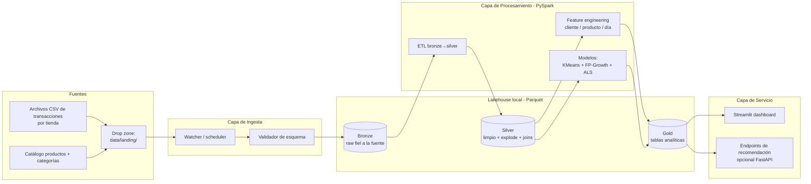
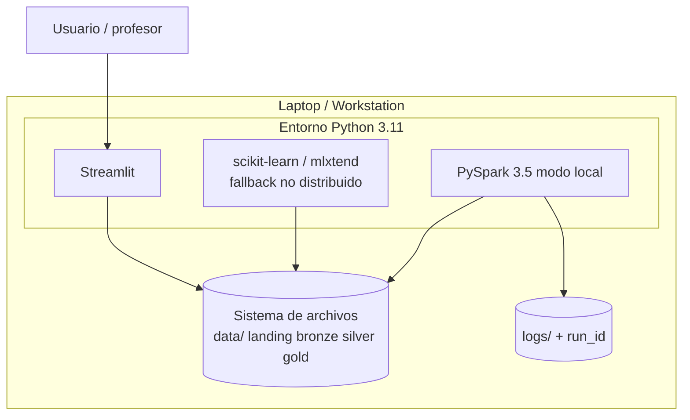
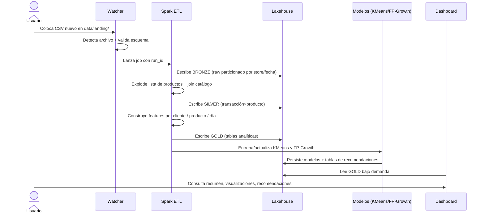
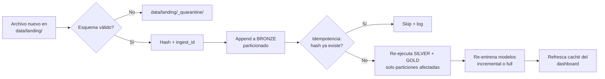
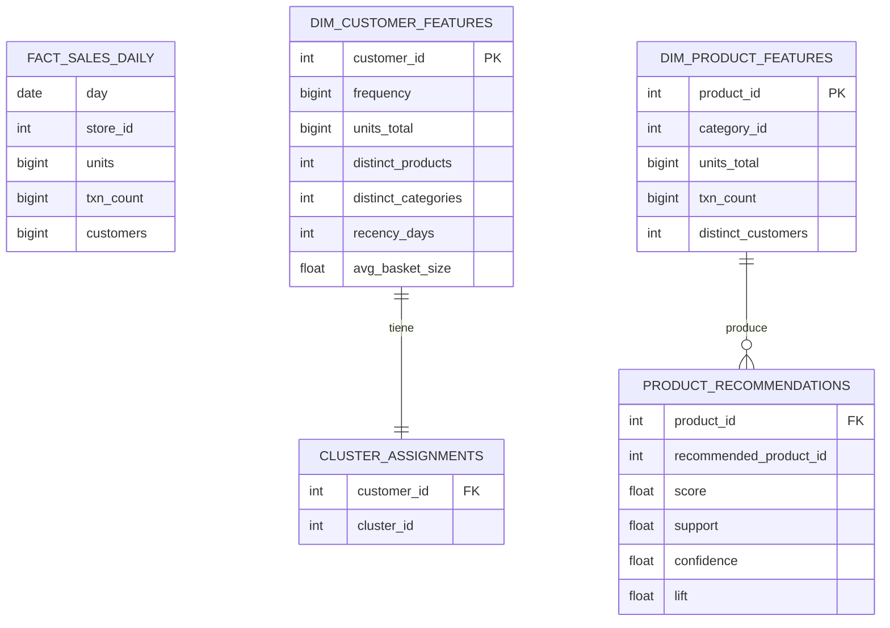

# Análisis y Modelado Analítico de Transacciones de Supermercado
## Propuesta de Arquitectura — Entrega Parcial (22 de mayo de 2026)

**Curso:** Procesamiento Distribuido de Datos — G1

**Versión:** 1.0

---

## 1. Resumen ejecutivo

Se propone una solución de datos modular, ejecutable de extremo a extremo, capaz de ingerir nuevos archivos de transacciones de supermercado, procesarlos de forma distribuida con **Apache Spark (PySpark)**, materializar tablas analíticas en formato **Parquet** bajo una **arquitectura medallion** (Bronze / Silver / Gold), y exponer los resultados en un **dashboard web Streamlit** que cubre el Resumen Ejecutivo, las Visualizaciones Analíticas y el Análisis Avanzado (segmentación K-Means y recomendador FP-Growth/ALS). La solución no se queda en consola ni en notebook: se entrega como aplicación funcional reproducible localmente.

---

## 2. Contexto y caracterización de los datos

El dataset entregado se compone de dos dominios:

| Dominio | Archivo | Registros | Esquema observado | Separador |
|---|---|---|---|---|
| Catálogo | `Products/Categories.csv` | ~70 | `category_id \| category_name` | `\|` |
| Catálogo | `Products/ProductCategory.csv` | ~95.000 | `product_id \| category_id` | `\|` |
| Transacciones | `Transactions/102_Tran.csv` | 314.286 | `fecha \| tienda \| cliente \| lista_productos` | `\|` |
| Transacciones | `Transactions/103_Tran.csv` | 407.130 | idem | `\|` |
| Transacciones | `Transactions/107_Tran.csv` | 254.633 | idem | `\|` |
| Transacciones | `Transactions/110_Tran.csv` | 132.938 | idem | `\|` |
| **Total transacciones** | | **1.108.987 canastas** | | |

**Particularidades relevantes para el diseño:**

- Cada fila representa **una canasta** (cliente × tienda × fecha): el ID de transacción es implícito y se construye en el ETL.
- El último campo es una **lista de IDs de producto separada por espacios** que debe ser *explotada* a formato largo. Tras el `explode` la tabla pasa de ~1.1M filas a un orden estimado de **decenas de millones de (transacción, producto)**, lo que **justifica un motor distribuido**.
- **No hay precios ni montos**. Todas las métricas son relativas: volumen (unidades), frecuencia, diversidad, recencia.
- La fecha mínima observada es `2013-01-01`. El `store_id` también aparece en el nombre del archivo, lo que se usará como llave de partición.
- No hay columna de cantidad: si un producto aparece *N* veces en la lista de una canasta, se interpreta como *N* unidades compradas.

---

## 3. Requerimientos

### 3.1 Funcionales (RF)

| ID | Requerimiento | Origen |
|---|---|---|
| RF-1 | Calcular total de unidades vendidas y número de transacciones | Resumen Ejecutivo |
| RF-2 | Top 10 productos y top 10 clientes por volumen / frecuencia | Resumen Ejecutivo |
| RF-3 | Días pico de compra (serie de tiempo + heatmap) | Resumen Ejecutivo |
| RF-4 | Categorías más "rentables" (proxy por volumen/frecuencia) | Resumen Ejecutivo |
| RF-5 | Serie de tiempo de ventas, boxplot por cliente/categoría, heatmap de correlaciones | Visualizaciones Analíticas |
| RF-6 | Segmentación de clientes con K-Means | Análisis Avanzado (A) |
| RF-7 | Recomendador producto–producto y cliente–producto | Análisis Avanzado (B) |
| RF-8 | Re-ejecución automática del pipeline al incorporar nuevos archivos | Análisis Avanzado (C) |

### 3.2 No funcionales (RNF)

- **Escalabilidad:** el ETL debe soportar volúmenes crecientes sin reescribirse → motor distribuido.
- **Modularidad:** capas desacopladas (ingesta, procesamiento, analítica, presentación) para que la incorporación de nuevas fuentes solo toque la capa de ingesta.
- **Reproducibilidad:** entorno declarado (`pyproject.toml` / `requirements.txt`), comando único de ejecución, opcionalmente Dockerfile.
- **Idempotencia:** re-procesar el mismo archivo no debe duplicar registros (se usa `MERGE` lógico por hash de fila o sobreescritura particionada).
- **Observabilidad mínima:** logging estructurado por etapa y un `run_id` por ejecución del pipeline.
- **Portabilidad:** ejecutable en una laptop (modo local de Spark) sin requerir cluster.

---

## 4. Arquitectura propuesta

### 4.1 Vista lógica (alto nivel)



### 4.2 Vista de despliegue (entorno local del estudiante)



### 4.3 Flujo end-to-end de una corrida



---

## 5. Componentes

### 5.1 Capa de ingesta
- **Drop zone:** carpeta `data/landing/` donde se depositan nuevos archivos (transacciones o catálogo).
- **Detector de cambios:** script `watch.py` basado en `watchdog` o ejecución manual `make ingest`; cada archivo recibe un `ingest_id` y se mueve a `data/landing/_processed/` al finalizar.
- **Validador de esquema:** verifica separador `|`, conteo de columnas, parseabilidad de fecha y de la lista de productos. Archivos inválidos van a `data/landing/_quarantine/` con un `.error.log`.

### 5.2 Capa de almacenamiento (Lakehouse medallion)
- **Bronze** — copia fiel del CSV en Parquet, particionado por `store_id` y `year=`/`month=`. Columnas: `date, store_id, customer_id, product_list_raw, source_file, ingest_ts`.
- **Silver** — tabla larga `transactions_items` tras `explode`: `transaction_id (hash de fila bronze), date, store_id, customer_id, product_id, category_id, category_name, qty`.
- **Gold** — *data marts* listos para consumo:
  - `fact_sales_daily` (date, store_id, units, txn_count, customers)
  - `dim_customer_features` (customer_id, frequency, units_total, distinct_products, distinct_categories, recency_days, avg_basket_size)
  - `dim_product_features` (product_id, category_id, units_total, txn_count, distinct_customers)
  - `cluster_assignments` (customer_id, cluster_id)
  - `product_recommendations` (product_id, recommended_product_id, score, rule_support, rule_confidence, rule_lift)

### 5.3 Capa de procesamiento (PySpark)
Cada paso es un módulo independiente bajo `src/pipeline/` y se invoca por CLI:

```
python -m pipeline.run --step bronze
python -m pipeline.run --step silver
python -m pipeline.run --step gold
python -m pipeline.run --step models
python -m pipeline.run --all
```

Justificación del motor distribuido: tras el `explode` de la lista de productos se estiman **>10M filas** en Silver; Spark permite procesarlas con SQL declarativo, soporta crecimiento futuro a cluster sin tocar el código de negocio, y es la herramienta central del curso.

### 5.4 Capa de modelos analíticos

| Modelo | Algoritmo | Librería | Entrada | Salida |
|---|---|---|---|---|
| Segmentación | **K-Means** | `pyspark.ml.clustering.KMeans` | `dim_customer_features` escalada | `cluster_assignments` + perfiles de clúster |
| Recomendador por canasta | **FP-Growth** (reglas de asociación) | `pyspark.ml.fpm.FPGrowth` | canastas desde Silver | reglas `antecedent → consequent` con `support, confidence, lift` |
| Recomendador cliente-producto | **ALS** (filtrado colaborativo implícito) | `pyspark.ml.recommendation.ALS` | matriz cliente×producto con `qty` como rating implícito | top-N productos por cliente |

Se selecciona `k` óptimo en K-Means mediante método del codo + silhouette sobre una muestra. Para FP-Growth se reportan reglas con `min_support` y `min_confidence` configurables.

### 5.5 Capa de servicio / visualización
- **Streamlit** como aplicación principal (`app/streamlit_app.py`) con tres páginas:
  1. **Resumen Ejecutivo** — KPIs e indicadores, Top-10, días pico, categorías.
  2. **Visualizaciones Analíticas** — serie de tiempo, boxplots, heatmap de correlaciones.
  3. **Análisis Avanzado** — visualización de clústeres (PCA 2D) y dos buscadores: "dado un cliente → recomienda" y "dado un producto → productos comprados juntos".
- Lectura directa de Parquet con `pandas`/`duckdb` para baja latencia en el dashboard. El usuario no necesita levantar Spark para *ver* resultados.

### 5.6 Capa de orquestación
Pipeline ejecutable con un `Makefile` (`make ingest`, `make pipeline`, `make app`) y un único punto de entrada en Python. Cada etapa registra `run_id`, duración y conteos en `logs/runs.jsonl`.

---

## 6. Estrategia para la incorporación de nuevos datos (RF-8)



**Principios:**
- **Append-only** en Bronze, **overwrite por partición** en Silver/Gold para evitar duplicados.
- **Procesamiento incremental** por particiones de fecha/tienda cuando es posible.
- **Re-entrenamiento** de modelos: full por ahora (los volúmenes lo permiten); preparado para warm-start de K-Means en versiones futuras.
- La adición de una **nueva tienda** (archivo `XXX_Tran.csv`) o de **nuevas fechas** no requiere cambios de código.

---

## 7. Stack tecnológico y justificación

| Capa | Herramienta | Por qué |
|---|---|---|
| Procesamiento | **PySpark 3.5** (modo local) | Eje del curso; escala a cluster sin reescribir; SQL declarativo |
| Almacenamiento | **Parquet** + medallion | Columnar, comprimido, particionable; estándar de lakehouse |
| ML | **Spark MLlib** (KMeans, FP-Growth, ALS) | Mantiene el pipeline distribuido extremo a extremo |
| Visualización | **Streamlit** | Entrega "no sólo notebook"; iteración rápida; multipágina nativa |
| Consulta dashboard | **DuckDB** sobre Parquet | Lectura analítica sin levantar Spark cada vez |
| Orquestación | **Makefile + CLI Python** | Suficiente para alcance del curso; sin sobre-ingeniería |
| Entorno | **Python 3.11 + uv/poetry** | Reproducible |
| Empaquetado opcional | **Docker** | Portabilidad para sustentación |

**Alternativas consideradas y descartadas:**
- *Pandas puro:* simple pero no defendible en un curso de procesamiento distribuido y frágil ante crecimiento del dataset.
- *Airflow / Prefect:* aporta poco frente al alcance académico y suma fricción operativa.
- *Postgres como gold:* añade un servicio sin beneficio claro; Parquet + DuckDB cubre el caso.

---

## 8. Modelo de datos (Gold — diagrama lógico)



---

## 9. Estructura del repositorio (a materializar en entregas 2-4)

```
proyecto/
├── data/
│   ├── landing/            # drop zone (entrada)
│   │   ├── _processed/
│   │   └── _quarantine/
│   ├── bronze/             # Parquet raw
│   ├── silver/             # Parquet limpio + explotado
│   └── gold/               # Marts analíticas
├── docs/
│   ├── arquitectura.md     # este documento
│   └── informe_tecnico.md  # entrega final
├── src/
│   ├── pipeline/
│   │   ├── ingest.py
│   │   ├── bronze.py
│   │   ├── silver.py
│   │   ├── gold.py
│   │   ├── models.py
│   │   └── run.py          # CLI
│   ├── features/
│   └── viz/
├── app/
│   └── streamlit_app.py
├── tests/
├── logs/
├── pyproject.toml
├── Makefile
└── README.md
```

---

## 10. Plan de trabajo alineado a entregas

| Fecha | Entrega | Avance esperado |
|---|---|---|
| 22-may-2026 | Arquitectura | Este documento aprobado |
| 29-may-2026 | Resumen ejecutivo + visualizaciones analíticas | Pipeline Bronze→Silver→Gold operativo + Streamlit páginas 1 y 2 |
| 05-jun-2026 | Código fuente + informe técnico | Repositorio completo y reproducible |
| 09/10-jun-2026 | Análisis avanzado | Páginas de clustering, recomendador y demo de ingesta de nuevos datos |

---

## 11. Riesgos y mitigaciones

| Riesgo | Impacto | Mitigación |
|---|---|---|
| Spark local con poca RAM | Pipeline se cae con dataset completo | Configurar `spark.driver.memory`, procesar por particiones (store_id), usar muestras durante desarrollo |
| Cardinalidad alta de productos (~95k) en FP-Growth | Reglas explotan combinatorialmente | Filtrar por `min_support` y por top-N productos por volumen antes de minar |
| Cold-start en ALS (clientes/productos nuevos) | Recomendaciones vacías | Fallback a top-N por categoría favorita del clúster del cliente |
| Esquema inestable en nuevos archivos | Job se rompe | Validador en ingesta + cuarentena, no se contamina Bronze |
| Re-procesamiento duplica datos | Métricas infladas | Bronze append + Silver/Gold overwrite por partición + hash de fila como `transaction_id` |

---

## 12. Conclusión

La arquitectura propuesta es **modular, distribuida, reproducible y completamente funcional** (no se limita a un notebook). Separa con claridad ingesta, almacenamiento, procesamiento, modelado y presentación, lo que permite que la incorporación de nuevos archivos de transacciones dispare automáticamente el recálculo de KPIs, la actualización de los modelos de segmentación y recomendación, y el refresco del dashboard que verá el usuario final.
